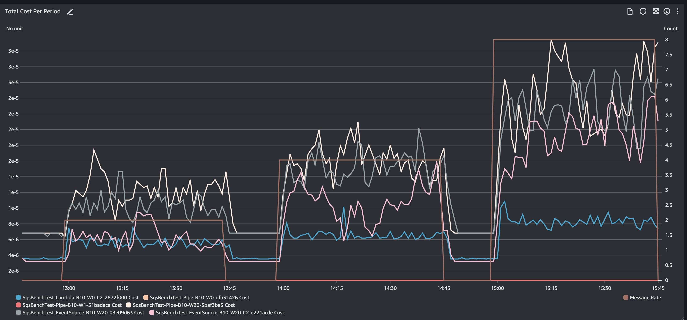

# SQSBench

## Motivation

This is a CDK application that can be deployed to your own Amazon Web Services (AWS) account to allow you to 
evaluate the resource utilisation/cost of using Amazon Simple Queue Service (SQS) in a serverless environment.

It will run automated tests to simulate messages and associated processing.

IMPORTANT: This application will incur charges on your account whilst tests are enabled.  You can leave
the application deployed in order to continue looking at historical results, but you should disable
the tests when you are not actively measuring.

SQS Supports multiple ways to consume messages from a queue, including:

- EventBridge Pipes
- Lambda Event Source/Event Source Mapping
- Manual Polling via Lambda

NB: This application uses SQS Standard Queues only

It's important to understand that SQS charges are levied based on the number of API requests made, rather
than the number of messages sent/received.  EventBridge Pipes are optimised towards high message rates and 
low latency delivery, and will upscale aggressively to meet demand, but downscale more conservatively.
If you have modest message rates, or are not concerned about latency, you may find that other polling mechanisms
are more cost effective.  This application is designed to help you find out the sweet spot.



## Usage

1. Clone the repository
2. `npm install` to install the dependencies
3. Edit `packages/app/index.ts` to configure and enabled the tests you want to run
4. `cdk deploy` to deploy the stack (assumes you have the CLI installed and configured for your AWS account)
5. Go to the AWS Console > CloudWatch > Dashboards and select the `SQSBench` dashboard to monitor the tests

## Methodology

Each test creates its own queue, a consumer lambda to act as the target for the messages, and any additional resources
necessary to direct the messages to the consumer (e.g. Pipe, Event Source Mapping or Lambda Poller), and a single 
producer lambda to generate the messages.

The producer lambda is invoked once per minute by an EventBridge scheduler rule.  The producer lambda checks for
the parameter store for the current state of the test, and generates an batch of messages based on the prevailing
message rate and randomised across the next minute according to the weighted distribution algorithm. The same 
batch of messages are then sent to each of the test queues, so that the polling performance can be compared.

## Concurrency Limitations

AWS Accounts have a limit of 1000 concurrent Lambda invocations.  This limit is shared across all functions in the 
account, and a large number of parallel tests could consume a good chunk of your lambda capacity, especially
when the message rate is into the thousands per minute.

When the producer runs, for each batch of messages to be sent to a queue, it split the batch into smaller batches of
up to 500 messages, and then invokes the emitter lambda with each of these smaller batches.  So for example,
each time the producer runs (once per minute) and it has messages to send, it will create at least one concurrent
lambda for each test (more if the message rate is >500), and at the same time, multiple invocations of the consumer
could be made by each test depending on the polling method, batch size and concurrency settings of the test.

## Configuration

Let's consider the following configuration options:

```typescript
new SqsBench(app, 'SqsBench', {
  minRate: 1,
  maxRate: 4096,
  consumerPerMessageDuration: Duration.millis(50),
  dutyCycle: 0.75,
  rateDurationInMinutes: 60,
  rateScaleFactor: 2,
  weightDistribution: [1, 2, 1],
  tests: [ /* ... */],
})
```

### minRate

The minimum message rate per minute to test.  After first deploy, the producer will start at a rate of 0 until the
top of the hour.  It will then start testing at the minRate

### maxRate

The maximum message rate per minute to test.  The producer will increase the message rate by the rateScaleFactor
every rateDurationInMinutes until it reaches the maxRate

### consumerPerMessageDuration

The duration in milliseconds that the consumer pauses for each message received.  This allows you to simulate message
processing time and allows for an estimation of overall costs.  Message rate and batch size will have a bearing on
the overhead of processing messages.

### dutyCycle

The proportion of the rateDurationInMinutes that the producer will be actively sending messages.  The producer will
be inactive for the remaining time.  This allows the various polling methods to scale back the overhead of dealing
with messages from the previous testing period.  For example, if there has been a sustained message rate of 1000+
messages per minute, an EventBridge Pipe takes a number of minutes for the poller fleet to scale back to its 
background level.  When message flow restarts, it takes another period of time for the poller fleet to scale up to
deal with the new message rate.  By allowing a period of inactivity you can ensure that the next message rate to be
tested reflects the real world significance of fluctuating message rates.

If you anticipate a sustained message rate, you can set the dutyCycle to 1, so that the producer is always active.

### rateDurationInMinutes

The duration in minutes that the producer will spend at each message rate.  In practice this should normally be 
equivalent to 1 or more hours, as it makes interpretation of the dashboard statistics easier.

### rateScaleFactor

The factor by which the message rate will be increased every rateDurationInMinutes.  This is a multiplier of the 
prevailing rate, so a factor of two would lead to a doubling of the message rate every rateDurationInMinutes. e.g.
1, 2, 4, 8, 16, ...

### weightDistribution

The distribution of messages across the minute.  The producer generates messages randomly across the minute, and the
weight distribution allows you to bias within the minute.

- [1] - All messages randomised across the minute
- [2, 1] - 66% of messages across the first half of the minute, 33% across the second half
- [1, 2, 1] - 25% of messages at the start, 50% in the middle, 25% at the end

This allows you to create some clustering of messages to simulate real world scenarios where messages are not evenly
distributed across the minute.  With low message rates, randomisation could easily lead to biases towards the start
or end of the minute, whereas for high message rates, the distribution will be more even.  By configuring the weight
distribution you can apply some bias to the message generation.

### tests

One or more tests that you want to run.  Individual tests can be defined and disabled.  Note that if you remove a test
from the array, its corresponding resources will be removed and the test will no longer be visible in the dashboard.

Cloudwatch Metrics store metrics, typically for 15 days at least, so by leaving the test defined by disabled,
you can still review historical metrics.

Even within test different poller types, there is latitude for fine tuning the poller configuration, so you
may well want to run more than one test for each poller type so you can see the effects.

NB: The producer is only enabled if there is at least one test enabled.

```typescript
tests: [
  { enabled: true, batchSize: 10, batchWindow: Duration.seconds(0), pollerType: PollerType.Lambda, maxSessionDuration: Duration.seconds(60), maxConcurrency: 2 },
//...
]
```
#### enabled

Whether the test is enabled or not.  If you want to disable a test, set this to false.

#### batchSize

The maximum number of messages to send to the consumer in each invocation.  This is a maximum, and there is no guarantee
that the batch is filled, depending on the poller type.

#### batchWindow

The maximum time to wait for the batch to be filled.  If the batch is not filled within this time, the consumer will
be invoked with the messages that have been received.

#### pollerType

The type of poller to use.  The options are:

- Lambda - A Lambda function that polls the queue for messages.  A simplistic implementation is provided that uses
  a single polling loop but with one or more concurrent consumers up to the maxConcurrency setting.  
  If throttled, the poller will not be requesting messages and a backlog can start to form.  The poller continues 
  to poll until an empty receive, up to the maxSessionDuration.
- Pipe - An EventBridge Pipe that sends messages to the consumer
- EventSource - An Event Source Mapping that sends messages to a Lambda function

#### maxSessionDuration

For Lambda pollers, the maximum time that the poller runs for.  The poller is started every minute and reads as
many messages as possible in the maxSessionDuration time.  If the poller gets and empty receive it will stop polling
until the next invocation.

#### maxConcurrency

For Lambda and Event Source pollers, the maximum number of consumers that can be invoked concurrently.  The consumer
will runtime is determined by the consumerPerMessageDuration setting.

For Event Source pollers, it can be omitted for no limit (other than account limitations)

#### highResMetrics

Whether to enable high resolution metrics, which gives visibility of how messages are distributed within the minute.
You only need to enabled one test with highResMetrics for this to work.  If it is disabled, it shows the standard
resolution metrics, but this isn't much use as its not sufficiently granular to show the distribution of messages
within the minute.  

Enabling this is really only useful when designing the weight distribution.  

IMPORTANT: can lead to high Cloudwatch charges if left enabled for long periods.

## Dashboard

The dashboard shows the following metrics:

### Total Cost Per Period

The sum of the cost for each test for the selected period (default, 1 minute).  The numbers can be tiny, but this
gives a good view over the period of each test and allows for comparison.  There is a good degree of fluctuation due
to AWS overheads/latencies, and you can smooth some of this out by switching the dashboard period to 5 minutes or more,
which will make it easier to compare the different tests.

### Total Cost Per Month

The sum of the cost for each test prorated to a monthly cost.  This can be more understandable than the cost per period
as its likely how you view your AWS costs based on invoices.  The costs are derived from each hour, so the widget will
be behind by up to an hour in the values it shows.

### Cost of Consumer

The cost of the consumer for the selected period.

### Cost Per Message

The cost per message for the selected period.

### Approximate Number of Messages Visible

The number of messages visible in the queue during the period (messages waiting to be polled)

### Approximate Age of Oldest Messages

The age of the oldest message in the queue during the period.

### Messages Received

The number of messages received by the queue during the period.

### Empty Receives

The number of empty receives by the queue during the period.

### Average Messages Received at Consumer

The average number of messages received by the consumer during the period.

### Weighted Message Rate

The weighted message rate for the period.  When highResMetrics is enabled, this allows you to see the way in which 
messages are being distributed across the minute.

## Packages

### Producer

A Lambda function that generates messages according to the prevailing message rate per minute.

The producer:
- Must be invoked once by an EventBridge scheduler rule every minute
- Must use the prevailing message rate per minute to determine the number of messages to produce
- Must calculate a delay for each message based on the specified distribution algorithm
- Must sort the messages according to ascending delay
- Must invoke the emitter in request/response mode, to allow for messages to be processed
- Must invoke all emitters with the same set of messages
- Must invoke an emitter for each queue specified
- Must create multiple emitter invocations to avoid exceeding 500 messages per invocation
- Must limit emitter invocations to 50 concurrent requests

### Emitter

A Lambda function that sends messages to a queue.  The messages are sent in batches of 10.  The emitter is invoked
by the producer.

The emitter:
- Must not send more than 10 messages per request to the queue.
- Must not make more than 50 concurrent requests to the queue.

### Poller

- Must be created for each queue specified as a poller based queue
- Must use the specified batch size, receive time and concurrency
- Must be invoked once per minute by an EventBridge scheduler rule
- Must poll the queue for messages using the specified batch size and receive time
- Must invoke the consumer with the messages received

### Consumer

- Must pause for the specified message duration for each message received
- Must return batch item failures if any

### Pipe

- Must be created for each queue specified as a pipe based queue
- Must use the specified batch size and batching window

### Event Source Mapping

- Must be created for each queue specified as an Event Source Map based queue
- Must use the specified batch size, batching window and concurrency